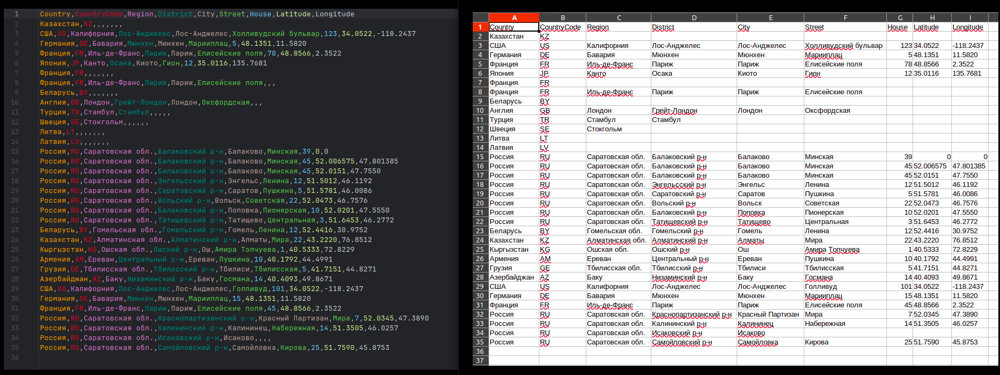
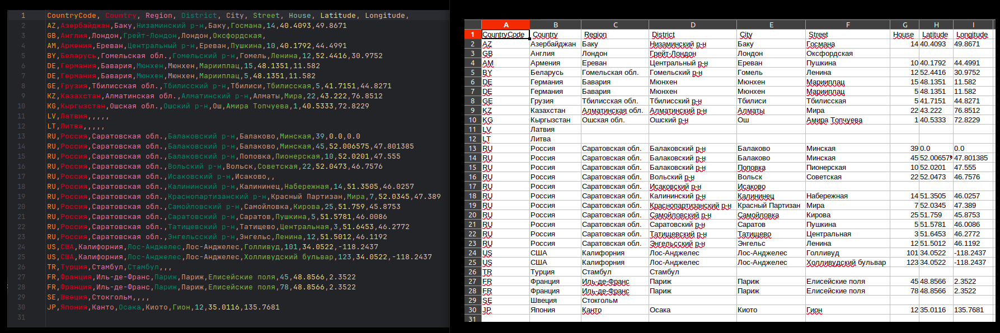

[EN](README.md)

### Приложение "MyPlace"
Серверная часть для маркетплейса.  
Вы можете организовать свою собственную торговую площадку.  

> **!** _Проект в разработке_</u>

### Готовые сервисы:
- **Статистика (mp-stats)** `MongoDB-reactive, WebFlux, Mapstruct, Junit, Mockito, Swagger`   
  - Сервис протестирован JUnit тестами, работая с базой 'mp-stats-test', которая после тестов автоматически очищается.  
  - Приложена коллекция Postman тестов. Запускать на пустой базе. Рекомендую запустить сервис с профилем 'test', работа будет вестись с тестовой базой 'mp-stats-test', которую вы можете перед/после тестов удалять для очистки данных. Иначе работа будет происходить с реальной базой 'mp-stats', тогда после тестов не забудьте очистить базу.
- **Безопасность (mp-security)** `JPA/Hibernate, Spring Security, PostgreSql, Redis, H2, Mapstruct, Swagger`  
  - Проверка регистрации пользователя и прав доступа по JWT.  
  - Приложена коллекция Postman тестов. Запускать на пустой базе с профилем 'test'. Можете добавить профили-маркеры: 
    test-confirmation-code-reading и test-mail-sender-bypassing для автоматического считывания кода подтверждения регистрации и для обхода ошибки, если еще не указан MAIL_SENDER, соответственно.
- **Профиль (mp-profile)** `JPA/Hibernate, Liquibase, PostgreSql, H2, Mapstruct, Swagger`
  - Сервис профиля пользователя предоставляет работу с данными: от даты регистрации до аватарки. 
  - Содержит в себе сервис `Geo` — работа с адресами.
  - Загружается предварительный набор гео-данных: все страны; регионы, районы, и города России; улицы Москвы, СПБ, Балаково.
  - Администрирование гео-данных: Возможность импортировать данные из CSV файла с получением отчета загрузки.
  
    <div style="margin-left: 20px;">

      Пример загружаемого файла и полученного отчета в виде так же CSV файла (см. [sample-file-to-import-geo.csv](docs/files/sample-file-to-import-geo.csv) и [sample-geo-data-load-report.csv](docs/files/sample-geo-data-load-report.csv)).  
      Для удобства добавлено отображение в табличном виде.   
      Процесс исключает дубликаты и сортирует последовательно по полям: `Country,Region,District,City,Street,House`.

    <details>
    <summary>Импорт:</summary>
    
      

    </details>

    <details>
    <summary>Отчет:</summary>
      
      

    </details>
    
    </div>

    <div style="margin-left: 20px;">

    #### Тестирование в Postman

    Если поместить файл для тестирования функциональности загрузки в нужный локальный каталог, коллекция будет работать должным образом как локально, так и в GitHub Actions. Рекомендую это для удобства локального тестирования. В качестве альтернативы вы можете вручную выбрать файл для локального тестирования непосредственно в самом тесте.  

    ###### Структура проекта в GitHub:

    ```
    root
      └── postman
          ├── MyPlace-mp-profile.postman_collection.json
          ├── MyPlace-mp-security.postman_collection.json
          ├── MyPlace-mp-stats.postman_collection.json
          └── data
              └── sample-file-to-import-geo.csv
    ```

    ###### Структура каталогов в локальной системе:

    ```
    ~/Postman
      └── files
          └── postman
              └── data
                  └── sample-file-to-import-geo.csv
    ```

    _~/Postman/files_ — Мой Postman Working каталог.  
    _~/Postman/files/postman/data_ — Каталог для файлов, используемых для тестирования загрузки.  
    Вы можете посмотреть/изменить Postman Working directory в Postman → Settings → General → Working Directory → Location.
    
    </div>

---

### Планируемый стек:
- Microservice architecture
- Maven
- Spring Boot
- Spring Data
- Spring Cloud
- Spring Security
- Tomcat, Netty
- Kafka
- JDBC, Hibernate
- Liquibase
- Postgresql, H2, MongoDB (reactive), Redis, Elasticsearch
- Junit, Mockito
- Docker-compose
- Kubernetes

---

### Open API

Для визуализации спецификации, вставьте ее в любой Swagger редактор, например, этот: https://editor.swagger.io

| Сервис      | Swagger UI URL                                                             | OpenAPI Docs URL                           | Спецификация                                                                         |
|-------------|----------------------------------------------------------------------------|--------------------------------------------|--------------------------------------------------------------------------------------|
| mp-test     | [localhost:9090/docs/swagger-ui.html](localhost:9090/docs/swagger-ui.html) | [localhost:9090/docs](localhost:9090/docs) | [mp-stats-v-1-0-0.json](docs/specification/mp-stats-service-spec-v-1-0-0.json)       |
| mp-security | [localhost:8078/docs/swagger-ui.html](localhost:8078/docs/swagger-ui.html) | [localhost:8078/docs](localhost:8078/docs) | [mp-security-v-1-0-0.json](docs/specification/mp-security-service-spec-v-1-0-0.json) |
| mp-profile  | [localhost:8076/docs/swagger-ui.html](localhost:8076/docs/swagger-ui.html) | [localhost:8076/docs](localhost:8076/docs) | [mp-profile-v-1-0-0.json](docs/specification/mp-profile-service-spec-v-1-0-0.json)   |

### Запуск

#### Убедитесь, что у вас установлены:
- JDK 11
- Apache Maven
- Docker (не ниже 19.03.0)
- Docker Compose (не ниже 1.28.0)

> **Примечание:** Все команды выполняйте из корня проекта.  
> Для удобства запуска предлагается стандартный вариант и альтернативный, с помощью скрипта `manage.sh`.
> Этот скрипт написан для использования в системах, основанных на Linux, включая, но не ограничиваясь, Ubuntu, CentOS, Debian и другими дистрибутивами.
> Скрипт не предназначен для работы в Windows или MacOS без использования дополнительных средств, таких как WSL (Windows Subsystem for Linux) или корректной настройки среды.  
> 
> При стандартном запуске (не через скрипт) используйте соответствующую команду для вашей версии Docker Compose:
> - Docker Compose V1: `docker-compose`  
> - Docker Compose V2: `docker compose`
>  
> **Имена контейнеров маркируются добавлением суффикса.** По умолчанию это 'std'.
При запуске через скрипт, суффикс будет изменен на `'prod'`, `'dev'`, `'test'` в зависимости с каким окружением вы запускаете.
При ручном запуске вы можете менять стандартную маркировку (`'std'`) на нужную вам, указав значение переменной окружения CONTAINER_MARK, вот пример:  
>`CONTAINER_MARK=моя_метка docker-compose -f docker/docker-compose-test.yml --profile full up`

#### 1. Соберите проект

<div style="margin-left: 20px;">

Собрать с запуском тестов перед сборкой. Должны быть установлены и запущены:
- Redis
- MongoDB
- PostgreSQL

```bash
mvn clean package
```

Собрать без запуска тестов

```bash
mvn clean package -DskipTests
```

Если вы хотите полностью пропустить компиляцию тестов и не включать их в сборку, вы можете использовать:

```bash
mvn clean package -Dmaven.test.skip=true
````

</div>

#### 2. Запустите проект (профили: `test`, `develop`, `production`)

<div style="margin-left: 20px;">

Для профиля `production` заполните соответствующие файлы с переменными окружения:
- docker/stats/.env.stats.prod
- docker/security/.env.security.prod
- docker/profile/.env.profile.prod

 Для запуска каждого профиля, выполните следующие команды:  
 (включена проверка `healthcheck`, так что нужно подождать)

<div style="margin-left: 20px;">

<details>
<summary>Запустить с профилем `test`</summary>

Профиль `test`


  ```bash
  docker-compose -f docker/docker-compose-test.yml --profile full up
  ```
или
  ```bash
  docker/manage.sh test up
  ```

[//]: # (</div>)

</details>

<details>
<summary>Запустить с профилем `develop`</summary>

Профиль `develop`

[//]: # (<div style="margin-left: 20px;">)

 ```bash  
docker-compose -f docker/docker-compose-dev.yml --profile full up
 ```
или
 ```bash
docker/manage.sh dev up
 ```

[//]: # (</div>)

</details>

<details>
<summary>Запустить с профилем `production`</summary>

Профиль `production`

[//]: # (<div style="margin-left: 20px;">)

 ```bash  
docker-compose -f docker/docker-compose-prod.yml --profile full up
 ```
или
 ```bash
docker/manage.sh prod up
 ```

> NOTE: В стандартном варианте (без скрипта) вы можете указать файл переопределения для docker-compose, 
> чтобы установить другие значения для сервисов. Это удобно для тестов в окружении 'production'.  
Пример:
> ```bash
>  docker-compose -f docker/docker-compose-prod.yml -f docker/docker-compose-prod.override.yml --profile full up
>  ```

</details>

</div>

</div>

<div style="margin-left: 20px;">

Запуск сервисов по отдельности (примеры с разными профилями)

<div style="margin-left: 20px;">

<details>
<summary>Запустить сервис `mp-stats`</summary>

Сервис `mp-stats`

<div style="margin-left: 20px;">

Профиль `test`

```bash  
docker-compose -f docker/docker-compose-test.yml --profile stats up
```
или
```bash 
docker/manage.sh test up stats
```

Профиль `develop`

 ```bash  
docker-compose -f docker/docker-compose-dev.yml --profile stats up
 ```
или
 ```bash
docker/manage.sh dev up stats
 ```

Профиль `production`

 ```bash  
docker-compose -f docker/docker-compose-prod.yml --profile stats up
 ```
или
 ```bash
docker/manage.sh prod up stats
 ```

</div>

</details>

<details>
<summary>Запустить сервис `mp-security`</summary>

Сервис `mp-security`

<div style="margin-left: 20px;">

Профиль `test`

```bash  
docker-compose -f docker/docker-compose-test.yml --profile security up
```
или
```bash 
docker/manage.sh test up security
```

Профиль `develop`

 ```bash  
docker-compose -f docker/docker-compose-dev.yml --profile security up
 ```
или
 ```bash
docker/manage.sh dev up security
 ```

Профиль `production`

 ```bash  
docker-compose -f docker/docker-compose-prod.yml --profile security up
 ```
или
 ```bash
docker/manage.sh prod up security
 ```

</div>

</details>

<details>
<summary>Запустить сервис `mp-profile`</summary>

Сервис `mp-profile`

<div style="margin-left: 20px;">

Профиль `test`

```bash  
docker-compose -f docker/docker-compose-test.yml --profile profile up
```
или
```bash 
docker/manage.sh test up profile
```

Профиль `develop`

 ```bash  
docker-compose -f docker/docker-compose-dev.yml --profile profile up
 ```
или
 ```bash
docker/manage.sh dev up profile
 ```

Профиль `production`

 ```bash  
docker-compose -f docker/docker-compose-prod.yml --profile profile up
 ```
или
 ```bash
docker/manage.sh prod up profile
 ```

</div>

</details>

</div>

</div>

