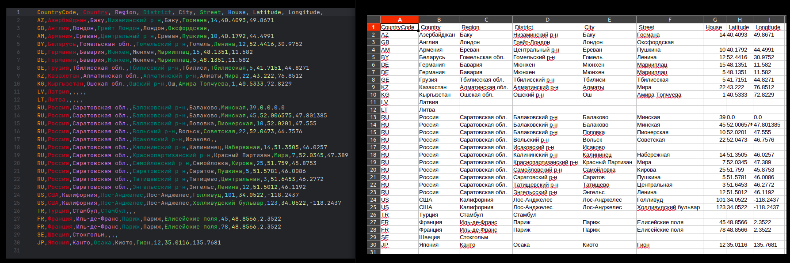

[RU](README-RU.md)

### What is the "MyPlace" application
The server part for the marketplace.  
You can organize your own platform.

<u>_Project in development_</u>

### Ready-made services:
- **Statistics (mp-stats)** `MongoDB reactive, Webflix, Mapstruct, Junit, Mockito, Swagger`  
  - The service has been tested by JUnit tests, working with the 'mp-stats-test' database, which is automatically cleared after the tests.  
  - A collection of Postman tests is attached. Run on an empty database. I recommend starting the service with the 'test' profile, the work will be carried out with the 'mp-stats-test' test database, which you can delete before / after the tests to clear the data. Otherwise, the work will take place with the real base of 'mp-stats', then after the tests do not forget to clear the database.
- **Security (mp-security)** `JPA/Hibernate, Spring Security, PostgreSql, Redis, H2, Mapstruct, Swagger`  
  - Checking user registration and access rights by JWT.  
  - A collection of Postman tests is attached. Run on an empty database with the 'test' profile. You can add marker profiles:
    test-confirmation-code-reading and test-mail-sender-bypassing to automatically read the registration confirmation code and to bypass the error if MAIL_SENDER is not specified yet, respectively.
- **Profile (mp-profile)** `JPA/Hibernate, Liquibase, PostgreSql, H2, Mapstruct, Swagger`
  - The user profile service provides work with data: from the date of registration to the avatar. 
  - It contains the `Geo` service — working with addresses.
  - Loading a preliminary set of geo-data: all countries; regions, districts, and cities of Russia.
  - Geo-data administration: Ability to import data from a CSV file with a loading report.
  
    <div style="margin-left: 20px;">

    Example of the uploaded file and the generated report, also in CSV format.  
    For convenience, a tabular representation is provided.  
    The process ensures that duplicate entries are excluded, and the data is sorted sequentially by the following fields: `Country,Region,District,City,Street,House`.

    <details>
    <summary>Import:</summary>

    

    </details>

    <details>
    <summary>Report:</summary>

    

    </details>

    </div>  

---

### Intended technologies:
- Microservice architecture
- Maven
- Spring Boot
- Spring Data
- Spring Cloud
- Spring Security
- Tomcat, Netty
- Kafka
- JDBC, Hibernate
- Liquibase
- Postgresql, H2, MongoDB (reactive), Redis, Elasticsearch
- Junit, Mockito
- Docker-compose
- Kubernetes

---

### Running the Project

#### To run locally make sure you have the following installed:
- JDK 11
- Apache Maven
- Docker (version 19.03.0 or higher)
- Docker Compose (version 1.27.0 or higher)

> **Note:** Execute all commands from the project root.

#### 1. Build the Project

<div style="margin-left: 20px;">

Build with tests before packaging. The following services must be installed:
- Redis
- MongoDB
- PostgreSQL

```bash
mvn clean package
```

Build without running tests

```bash
mvn clean package -DskipTests
```

If you want to completely skip the test compilation and not include them in the build, you can use:

```bash
mvn clean package -Dmaven.test.skip=true
````

</div>

#### 2. Run the Project (profiles: `test`, `develop`, `production`)

<div style="margin-left: 20px;">

For the `production` profile, fill in the corresponding environment variable files:
- docker/stats/.env.stats.prod
- docker/security/.env.security.prod
- docker/profile/.env.profile.prod


To run each profile, execute the following commands:  
(including the `healthcheck`, the longest interval is set to 60 seconds, so please wait)

<div style="margin-left: 20px;">

<details>
<summary>Run with the `test` profile</summary>

`test` profile


  ```bash
  sudo docker-compose -f docker/docker-compose-test.yml build
  ```

  ```bash
  sudo docker-compose -f docker/docker-compose-test.yml up
  ```

[//]: # (</div>)

</details>

<details>
<summary>Run with the `develop` profile</summary>

`develop` profile

[//]: # (<div style="margin-left: 20px;">)

 ```bash  
sudo docker-compose -f docker/docker-compose-dev.yml build
 ```

 ```bash
sudo docker-compose -f docker/docker-compose-dev.yml up
 ```

[//]: # (</div>)

</details>

<details>
<summary>Run with the `production` profile</summary>

`production` profile

[//]: # (<div style="margin-left: 20px;">)

 ```bash  
sudo docker-compose -f docker/docker-compose-prod.yml build
 ```

 ```bash
sudo docker-compose -f docker/docker-compose-prod.yml up
 ```

</details>

</div>

</div>

<div style="margin-left: 20px;">

Running services individually (examples with different profiles)

<div style="margin-left: 20px;">

<details>
<summary>Run the `mp-stats` service</summary>

`mp-stats` service

<div style="margin-left: 20px;">

`test` profile

```bash  
sudo docker-compose -f docker/stats/docker-compose-stats-test.yml build
```

```bash 
sudo docker-compose -f docker/stats/docker-compose-stats-test.yml up
```

`develop` profile

```bash 
sudo docker-compose -f docker/stats/docker-compose-stats-dev.yml build
```

```bash 
sudo docker-compose -f docker/stats/docker-compose-stats-dev.yml up
```

`production` profile

```bash 
sudo docker-compose -f docker/stats/docker-compose-stats-prod.yml build
```

```bash 
sudo docker-compose -f docker/stats/docker-compose-stats-prod.yml up
```

</div>

</details>

<details>
<summary>Run the `mp-security` service`</summary>

`mp-security` service

<div style="margin-left: 20px;">

`test` profile

```bash 
sudo docker-compose -f docker/security/docker-compose-security-test.yml build
```

```bash 
sudo docker-compose -f docker/security/docker-compose-security-test.yml up
```

`develop` profile

```bash 
sudo docker-compose -f docker/security/docker-compose-security-dev.yml build
```

```bash 
sudo docker-compose -f docker/security/docker-compose-security-dev.yml up
```

`production` profile

```bash 
sudo docker-compose -f docker/security/docker-compose-security-prod.yml build
```

```bash 
sudo docker-compose -f docker/security/docker-compose-security-prod.yml up
```

</div>

</details>

<details>
<summary>Run the `mp-profile` service`</summary>

`mp-profile` service

<div style="margin-left: 20px;">

`test` profile

```bash 
sudo docker-compose -f docker/profile/docker-compose-profile-test.yml build
```

```bash 
sudo docker-compose -f docker/profile/docker-compose-profile-test.yml up
```

`develop` profile

```bash 
sudo docker-compose -f docker/profile/docker-compose-profile-dev.yml build
```

```bash 
sudo docker-compose -f docker/profile/docker-compose-profile-dev.yml up
```

`production` profile

```bash 
sudo docker-compose -f docker/profile/docker-compose-profile-prod.yml build
```

```bash 
sudo docker-compose -f docker/profile/docker-compose-profile-prod.yml up
```

</div>

</details>

</div>

</div>
